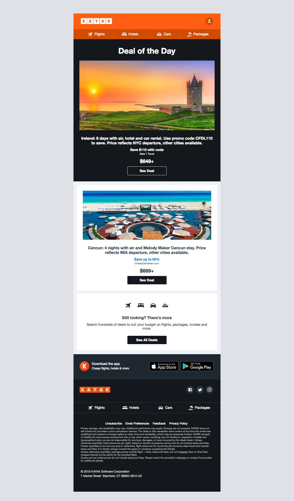

# Kayak HTML Email

## Description

This email was created using [Foundation for Emails 2](https://get.foundation/emails), which the stack consists of Gulp, npm, SASS, and HTML. I created this using a reference image.

## Reference Image

## Final Product

[Hosted on Netlify](#)